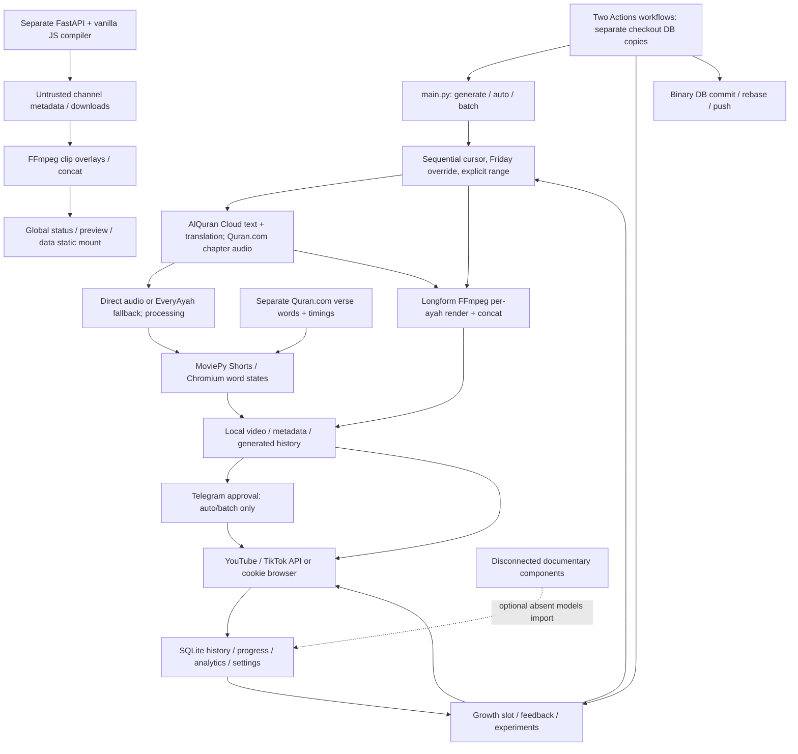

# Quran Reels Maker — evidence-based audit

**Audit date:** 2026-09-26. **Repository:** `D:\05_Work\quran-reels-maker`. **Commit:** `b9cabd4dcf48320640822436e2cfbef0e0c59a5d`.

This is an audit of the current tracked source and its reachable behavior. No application fixes, credential operations, publications, notifications, workflow runs, commits, or pushes were performed. The existing modified `database/quran_reels.db` and untracked `docs/audit-prompt-gpt6-sol.md` were preserved. All execution used copied source or selected source AST definitions, synthetic assets, disposable databases, and mocked external clients.

## 1. Executive assessment

**The project is not reliable enough for unattended publishing in its present form.** The blockers are concrete integrity and control failures, rather than missing cosmetic features:

- The audio recording and timing source are selected independently; a reciter-free audio filename can substitute another reciter's bytes. Optional intros shift text three seconds relative to externally muxed recitation. Expected timing errors become successful static renders. Long verse text can leave the visible frame. See QRM-01–05.
- Long-form generation can skip failed verses or stop early while reporting a full surah. Growth Shorts can receive a “Full” title, and the web compiler invents reciter/surah labels when extraction is uncertain. See QRM-06–08.
- Required approval fails open on missing configuration or delivery failure; replies are not bound to the specific video/sender. Private YouTube test mode still attempts TikTok posting. See QRM-09–11.
- Generation consumes sequential position before publication; Friday overrides can create impossible verse positions. Overlapping jobs are not reserved or isolated, and the SQLite retry loop cannot recover a failed flush. See QRM-12–15.
- Workflow dry-run still changes decisions/analytics and commits state. Workflow inputs become executable shell source. Independent binary database commits lack a safe merge/recovery path. See QRM-16, 19–21.

**What is supported by evidence:** all 69 tracked Python files parse; 84 baseline tests and both selected real Chromium renderer tests pass in isolation. Verse arithmetic and existing-row Quran wrap have tests/source support. The current eight reciter IDs agree with the repository's frozen identity snapshot. Word timing parsing handles numeric strings and rejects backwards/overlapping segments. Shorts frames contain no English translation. The Chromium renderer correctly produces transparent, distinct four-word states. A tiny real H.264/AAC fixture has coherent dimensions and stream durations. Growth failures explicitly map to a nonzero CLI exit; older blanket claims to the contrary are incorrect.

These positives establish useful local behavior, **not authentic recording/verse alignment, current upstream identities, successful moderation/processing, or intended live account identity**. No real Quran audio was fetched or listened to, and no authenticated platform contract was exercised. Native FastAPI startup remains untested because its three main runtime dependencies are absent and its imports target an external scratch directory. Findings distinguish those limits from confirmed defects.

The [remediation plan](audit-remediation-plan.md) defines focused work and acceptance gates. Detailed area notes and reproductions are linked below; the stable QRM identifiers in this report take precedence over the agents' provisional identifiers.

## 2. Snapshot, isolation, and architecture

### Repository and environment

| Item | Observed evidence |
| --- | --- |
| Initial state | `git status --short`: modified production DB; existing untracked audit prompt. Git also warned that `.pytest_cache/` was inaccessible. |
| Inventory | 108 tracked files; 69 Python sources. [Inventory](../outputs/audit/inventory.txt), [syntax results](../outputs/audit/syntax.json). |
| Explicit interpreter | `D:\05_Work\quran-reels-maker\venv\Scripts\python.exe`, Python 3.14.0, Windows AMD64. Default `python` resolves to another application's Hermes environment and was not used. |
| Installed key dependencies | pytest 9.0.2; pytest-mock 3.15.1; SQLAlchemy 2.0.46; MoviePy 1.0.3; Pillow 12.1.0; NumPy 2.4.1; Playwright 1.58.0; OpenCV headless 4.13.0.90; pydub 0.25.1; google-auth 2.48.0. [Versions](../outputs/audit/environment.json). |
| Missing web dependencies | FastAPI, Uvicorn, yt-dlp are not installed in that interpreter. No installation attempted. |
| Media/browser | WinGet FFmpeg/FFprobe 8.0.1; installed Playwright Chromium usable. libx264 tiny render succeeded. A 320×180 one-frame h264_nvenc null-output probe succeeded; a prior 64×64 probe failed on the encoder's minimum dimensions, not missing hardware. |
| CI assumptions | Both workflows select Python 3.11 on Ubuntu, install FFmpeg/ImageMagick, and force libx264 during rendering. Only growth installs Chromium. Neither workflow runs pytest. |
| Preservation | SHA-256 inventory of existing tracked files taken before runtime checks. Final comparison found no changes to any pre-existing tracked file, including the already-modified DB. See final preservation artifact. |

Applicable user AGENTS instructions were read. No additional project AGENTS file was found by the scoped inventory. The engineering code-review skill supplied the security/correctness lens. Broad research was delegated as requested, then important conclusions were checked against source and local evidence.

### Data flow and trust boundaries

Trust boundaries: external Quran/text/audio responses; external titles/thumbnails; AI responses; Telegram sender/request identity; OAuth/cookie account identity; user/workflow values entering paths or shell; local stores entering overlapping processes; and separate CI snapshots attempting to persist common state.

### Reachable features and sequence

| Entry point | Actual flow and state timing |
| --- | --- |
| `generate` | Explicit range or sequential/Friday range → fetch/render → history commit → cursor commit for non-explicit requests. Records actual returned range. Errors return None. |
| `auto`, `batch` | Call generate → optional Telegram → metadata generated after video review → YouTube public/private → history update → optional TikTok. Batch repeats and prints counts without a failure exit policy. |
| `upload`, `tiktok` | Direct user-invoked uploads; no review gate. YouTube accepts supplied/stem metadata; TikTok infers filenames or defaults arbitrary media to 1:1. These are explicit publishing routes, not hidden automatic exploits. |
| `longform compile` | Manual local per-ayah render/concat; no upload/history recording in this branch. |
| `longform auto` | Select group absent from compiled/uploaded history → render → mark compiled → upload unlisted, or private with test → update receipt. A failed upload leaves group “compiled” and therefore excluded from the next queue. |
| `growth-engine run` | Time/forced slot → heuristic format/reciter/surah/title/thumbnail → public upload → history/progress; no Telegram gate. “Weekly”, “sleep”, and “full” long modes all call single-surah generation with loop_count=1. |
| Analytics / feedback / experiments | Public statistics update by video ID; feedback changes downweights/forced queue. Experiment registration creates synthetic IDs, with several winner settings having no consumers. |
| Web | Fetch title-derived metadata → select/order/edit labels → download → compile → two polling loops → preview. No publishing endpoint. Data/temp/progress shared globally; import paths are outside repo. |
| Documentary | Seven tracked components; missing configuration/models and invalid Quran helper imports. No active CLI/workflow entry point found. Optional database import is caught. Incomplete feature, not a demonstrated core outage. |

Mutable stores include SQLite, text/audio JSON caches, background usage JSON, token JSON/pickle/cookie files, logs, shared audio/karaoke/temp folders, and video/metadata output. Root settings load dotenv, create directories and probe FFmpeg on import (`config/settings.py:10,40,66,112`); models initialize tables on import (`database/models.py:272`); main installs file logging (`main.py:28`). Disabling pytest cache alone would not isolate these writes.

## 3. Coverage matrix

S = source review; M = bounded mocked/AST execution; L = real local library/browser/media/SQLite execution; D = primary documentation. No entry implies live service validation.

| Area | Files inspected | Validation | Remaining boundary |
| --- | --- | --- | --- |
| CLI/config/docs | main.py, config/settings.py, .env.example, requirements.txt, README.md, setup guide | S, isolated main imports through suite, AST parse | Real credentials/default live settings deliberately unread |
| Quran sources/identity | core/quran_api.py, quran_v4_api.py, ayah_fetcher.py, word_timings.py, reciters.json | S/M, timing/verse/mapping unit tests, D | Current upstream IDs, waveform identity, basmala conventions |
| Shorts audio/video | audio_processor.py, video_generator.py, karaoke_renderer.py, text_renderer.py, dynamic_text.py, style_config.py, utils.py, sync spec | S/M/L: source probes, mux/trim, Chromium, long-text screenshot | Authentic Quran listening, full 1080p pipeline on Linux, MP3 delay alignment |
| Background assets | background.py, background_history.py, stock_footage.py, person_detector.py, download_backgrounds.py, asset READMEs/fonts | S, detector fallback tests | Actual licensing/provenance, detection reliability on real clips |
| Persistence/progression | database/models.py, init.py, verse_scheduler.py, cache/history write code | S/M/L: fresh/override/duplicate/lock/thread probes | Existing production schema/rows intentionally not queried; crash recovery workflow not run |
| Growth/analytics | growth_engine.py, ai_brain.py, model settings/analytics/AB tables | S/M, baseline guards and title/dry-run probes, D | Real analytics/cost/model output, calibrated outcome evidence |
| Publishing/approval | youtube/auth.py/uploader.py, tiktok/auth.py/uploader.py, notifications/telegram_bot.py | S/M/L: local Credentials, mocked transitions, D | Channel/account, privacy enforcement, moderation, refresh/PKCE/platform behavior |
| Longform | all six tracked longform files | S/M: omitted verse and duration-stop probes; actual source import in tests | Full-length encoding, listening, real uploads; output validation absent |
| Documentary | cost_tracker.py, director.py, quality_validator.py, quran_scene_renderer.py, quran_scene_resolver.py, shot_plan.py, stock_provider.py | S/AST, repository reachability search | Incomplete modules; no active production flow to test |
| Web backend | main.py, downloader.py, compiler.py, download_font.py, requirements.txt | S/M: six backend probes; L missing-font FFmpeg filter failure | Native FastAPI lifecycle, yt-dlp extractor/network, real full compilation |
| Web UX/security | index.html, app.js, style.css | S/L actual Chromium frontend, fully mocked routes, desktop/mobile screenshots, benign XSS marker | Native backend interaction, dedicated download UX absent, full accessibility audit |
| Automation/security | both workflows, credential/logging code, .gitignore | S/D; redacted pattern scan of 92 tracked textual files | Workflows, shell payloads, private logs/history, scheduled jobs not executed |
| Validation | pytest.ini, all 12 tests/ files, four root test scripts, two web scripts | S; 84 fast tests + 2 real Chromium tests; 69 syntax checks | Root/web scripts not run due unsafe side effects; CI Python 3.11 dependency install not reproduced |

Detailed source notes: [media](../outputs/audit/media/review-notes.md), [publishing/state](../outputs/audit/state/publishing-state-findings.md), [web/documentary](../outputs/audit/web/notes.md).

## 4. Prioritized findings register

Severity uses demonstrated consequence and reachability: **High** blocks a relevant unattended/content/security flow; **Medium** needs focused reliability/security work; **Low** is bounded usability/maintenance. Confidence labels separate confirmed local/source behavior from credible unverified consequences. No unauthenticated critical vulnerability or live content incident is claimed.

### Quran and media integrity

#### QRM-01 — Audio/recording identity is not bound to word timing (High)

**Confidence:** confirmed source separation/cache collision; live recording mismatch credible and unverified. **Flow:** Shorts and shared ayah fetching.

**Evidence:** `core/ayah_fetcher.py:91,96`, `core/word_timings.py:78,134`, `core/video_generator.py:333`, `core/audio_processor.py:333,336,355,357`, `core/quran_v4_api.py:167`.

Chapter audio is fetched separately from verse timings; the timing response's audio URL is unused. Direct V4 audio files use only surah/ayah and reuse any existing file. Two synthetic reciters returned the first one's bytes with one download. Serial Shorts normally clean first, limiting that serial trigger; overlapping flows remain unsafe. A failed chapter lookup can fall back to silence-trimmed EveryAyah audio while later using Quran.com word origins. Real trim changed 2000ms input to 1048ms without returning an offset. V4 direct audio correctly skips trimming.

**Fix/acceptance:** use one recording bundle with reciter/recording/source URI, checksum and exact duration; isolate job files; propagate transformation offsets. Two simultaneous reciters and a chapter-source failure must never substitute recordings or reuse unrelated timing. [Reproduction](../outputs/audit/media/source_reproduction_results.json).

#### QRM-02 — Optional intro shifts text relative to recitation (High, confirmed)

**Evidence:** `core/video_generator.py:204,416,448,473`. With ENABLE_INTRO_FRAME=true, video gains a 3s title card after audio composition; export supplies unchanged external audio. The extracted orchestrator produced 8.08s video content versus 4.1s external audio. Default source flag is false; .env.example enables it.

**Consequence:** verse text/highlights are delayed while audio starts during the title card.

**Fix/acceptance:** compose both streams on the same timeline, including silent intro. Synthetic visual cue/audio impulse must align with intro on/off and every verse boundary.

#### QRM-03 — Overlong first ayah has capped frames and uncapped audio (High, confirmed)

**Evidence:** `core/video_generator.py:227,279,403,430,473,488`. Maximum admission is conditional on an ayah already being present. A 90s first verse gives 59s frames, 90.1s external audio, and a complete 1–1 range.

**Observed precision:** real MoviePy 1.0.3 mux yielded 1.000000s video, 1.516009s audio/container. This proves unequal timelines, not assured audio truncation. Player/transcoder handling after the last frame is unverified.

**Fix/acceptance:** route overlong complete verses to a suitable format or stop visibly before success; never cap only frames. FFprobe stream durations, visible word coverage, claimed range and format must agree. [Real mux evidence](../outputs/audit/media/real_media_results.json).

#### QRM-04 — Expected timing errors become successful static renders (High, confirmed)

**Evidence:** `core/word_timings.py:117,124`, `core/video_generator.py:334,355`; approved word-sync spec. A mapped reciter's missing/mismatched timings raise locally, but the orchestrator catches the error and exports static text successfully.

**Fix/acceptance:** mapped unusable expected timings must fail generation with actionable diagnostics and no history/progress/upload. Static output remains appropriate for explicitly unmapped reciters. Test the whole orchestration, not just the timing helper.

#### QRM-05 — Long karaoke text is clipped outside the frame (High, confirmed synthetic/browser)

**Evidence:** `core/karaoke_renderer.py:49,50,55,57,58,137`, `core/video_generator.py:147,151`, `core/style_config.py:34`. Fixed font/line height and viewport have no height fitting or timing-aware pagination.

**Reproduction:** 130 repeated synthetic Arabic words at the actual 1080×1920/72px style have y=-508.77 and height=2937.55; first/last lines leave the screenshot. No authentic long ayah was fetched. [Screenshot](../outputs/audit/media/synthetic_long_verse_layout.png).

**Fix/acceptance:** paginate with preserved timing or measured readable fitting. All words, marks and active highlights in longest supported Quran verses must remain within safe margins on both runtimes.

#### QRM-06 — Incomplete longform output is described as complete (High, confirmed mocked/source)

**Evidence:** `longform/compiler.py:612,614,662,664,667,672,703,795,843,913`, `main.py:875,879`, `longform/scheduler.py:138`.

Failed fetches/renders continue; the duration stop breaks early. Metadata uses requested ranges, “Full/كاملة”, and queue records use requested clip counts. Mocked Surah112 with missing verse2 rendered [1,3,4] yet returned full-recitation title/description. A 2s test bound returned [1,2] with the same full claim. FFmpeg was mocked; orchestration defect is proven, authentic incomplete publication was not performed.

**Fix/acceptance:** retain per-verse manifest and fail incomplete mandatory coverage; metadata/history derive from verified output. Any failed verse, max-duration stop or concat/probe failure must prevent a full claim and automatic upload.

#### QRM-07 — Partial growth Shorts receive “Full” title fallback (High, confirmed)

**Evidence:** `core/growth_engine.py:242,289,313,503,506,527`. Title fallback includes Full without accepting actual coverage. Current Fatihah/alafasy constants trigger it; the render may include only three verses.

**Fix/acceptance:** pass verified ranges/completeness into metadata generation; deterministic partial-title fallback. Across all reciters/formats, Full/كاملة is impossible unless every claimed verse is included. The “vidIQ” score is a local heuristic, not a service measurement.

#### QRM-08 — Web compiler fabricates missing reciter/surah attribution (High, confirmed browser)

**Evidence:** `quran_compiler/frontend/app.js:236,240,362,363`, `quran_compiler/backend/downloader.py:113,199`, `quran_compiler/backend/compiler.py:144,157,162`.

Unknown imported titles/cleared fields become Yasser Al-Dosari / Surah Al-Mulk and are sent to overlays/chapters. Actual frontend synthetic payload demonstrates this. Title parsing itself is heuristic and cannot authenticate the voice.

**Fix/acceptance:** unresolved fields stay visibly unresolved; require reviewed source identity/verse coverage, with provenance. Unknown/conflicting titles and cleared values must never silently compile under an invented identity.

#### QRM-30 — AI metadata/translation lacks content validation and review binding (High credible content risk)

**Evidence:** `core/ai_brain.py:226,249,264,295,317,332`, `youtube/uploader.py:70,83,94,116`, `main.py:243,299`.

Source confirms key-presence checks without complete schema/type/length or canonical religious-claim validation. Known-name replacement cannot validate unknown reciters, reflections or verse meaning. Metadata is generated after video-only approval. Missing translations are skipped; AI-path translation/attribution is not independently checked, and fallback has no English translation. No actual hallucination or paid call was reproduced.

**Fix/acceptance:** deterministic source-attributed Quran/translation fields, typed bounded AI suggestions, and approval bound to final media plus metadata. Malformed tags/types, conflicting identities, unsupported religious benefits and altered translations must fail or require review before publication.

#### QRM-37 — Timing validation and optional translation failure are incomplete (Medium, confirmed)

**Evidence:** `core/word_timings.py:54,58,61,64,111,124`, `core/video_generator.py:156,161,285`, `core/quran_api.py:146`, `core/ayah_fetcher.py:114`.

A one-word empty string with segment [99,99,-100,5000] is accepted; positions, shape, negativity and actual audio duration are unchecked. Separately, translation=None causes a TypeError in generation even when text/audio/local background are valid and Shorts show no English translation.

**Fix/acceptance:** strict positional/text/audio-bound validation while preserving supported string numerics; optional translation cannot block independent Arabic rendering. Malformed payloads fail before export; unavailable translation has an explicit availability state.

#### QRM-38 — Quran marks are removed and clip-boundary recitation is attenuated (Medium; transformation confirmed, domain consequences unverified)

**Evidence:** `core/text_renderer.py:47,144`, `longform/compiler.py:120,178,402,403`, `quran_compiler/backend/compiler.py:95,96`, `quran_compiler/frontend/index.html:55`.

Static Arabic/longform rendering removes every U+06D6–U+06ED character, including small waw and Quran annotation signs, regardless of actual font support. Standard harakat remain; Chromium preserves input. Web clips apply default 3s audio fades at recitation boundaries without silence padding, potentially obscuring words; longform applies shorter fades. Samples are attenuated, not proven trimmed.

**Fix/acceptance:** preserve canonical text/marks with a reviewed font/shaping policy; fade visuals or verified silence only. Golden glyph cases and synthetic boundary waveforms must be retained; a Quran typography/listening reviewer must approve any transformation scope.

### Publishing, progress, credentials and automation

#### QRM-09 — Required approval fails open; growth omits the gate (High, confirmed)

**Evidence:** `main.py:237,284,286,312`, `core/growth_engine.py:534,618`. Missing Telegram configuration bypasses required approval; failed delivery explicitly proceeds. Mocked delivery failure caused public YouTube and TikTok attempts. Growth has no Telegram gate, regardless of APPROVAL_REQUIRED.

**Fix/acceptance:** one automatic publishing policy; missing config/delivery errors leave pending state. No automatic platform upload mock may be called without required approval. Explicit manual upload remains a separately authorized route.

#### QRM-10 — Approval is not bound to video/request/sender (High in groups/concurrent reviews, confirmed)

**Evidence:** `notifications/telegram_bot.py:142,167,179,184,188`, `main.py:243,257`. Returned message ID is ignored; only chat is filtered. An unsolicited group member's “ok” approves the current video. Initial update clearing after sending can discard immediate valid replies; shared polling can consume another job's response.

**Fix/acceptance:** authorized sender IDs plus request nonce/media/metadata hash, reply/callback binding and durable approvals. Wrong sender/stale reply is ignored; immediate valid reply works; concurrent requests approve only their own content.

#### QRM-11 — Private YouTube test mode still posts to TikTok (High, confirmed requested action)

**Evidence:** `main.py:312,330,351`, `tiktok/uploader.py:61,270,278,294,312`. Mocked auto --test selected private YouTube, then TikTok with no privacy argument. API requests PUBLIC_TO_EVERYONE; browser route does not select private.

**Limit:** actual visibility depends on permissions/account state and was not checked.

**Fix/acceptance:** explicit per-platform identity/privacy policy; suppress platforms that cannot guarantee test privacy. Neither auto nor batch test may issue public init or browser Post.

#### QRM-12 — Generation cursor advances before review/publication; regeneration consumes new ranges (High operational gap, confirmed)

**Evidence:** `main.py:98,109,213,263,272,283,319,388`. The source intentionally calls this a generation cursor, but automatic publishing treats its next range as the journey. Rejection/timeout/upload failure leave consumed ranges with generated history; regeneration uses the next range. Deleted rejected files retain misleading generated status. Three regenerate responses exhaust the loop then attempt upload of a deleted file; normal uploader existence checking prevents that upload.

**Fix/acceptance:** separate generated reservations and published cursor; regenerate the same range; explicit pending/rejected/failed outcomes and exhaustion return. Failures must preserve a resumable reviewed job and must not consume publication coverage. This is not proof that generated history is absent.

#### QRM-13 — Overrides corrupt position; fresh state fails last-verse rollover (High, confirmed isolated SQLite)

**Evidence:** `main.py:63,109`, `core/verse_scheduler.py:119,151,162,172,174`, `core/growth_engine.py:546`.

Starting at 1:1 then advancing a Kahf override ending50 saves 1:51. A fresh table followed by full Fatihah saves 1:8; subsequent selection is invalid. Existing-row end114 correctly wraps to1:1.

**Fix/acceptance:** reserve sequential identity separately from thematic overrides; compute validated next position consistently for fresh/existing rows. Override leaves original journey unchanged, Fatihah ends at2:1, and 114 ends at1:1.

#### QRM-14 — CLI jobs have no reservation or file/state ownership (High; primitives confirmed, duplicate live upload unverified)

**Evidence:** `core/verse_scheduler.py:115,149,159,287`, `database/models.py:106,126`, `core/video_generator.py:211,344,485`, `core/audio_processor.py:394,396`, `longform/compiler.py:509,633`.

Two reads select1:1–3; schema permits two singleton rows and duplicate history. Two synchronized real SQLite sessions both advance but total_reels remains1. Dedup helper has no active callers. Global audio cleanup/karaoke names and longform temp removal can destroy peer work. Growth uploads before durable history, so remote success followed by DB failure risks reposting.

**Fix/acceptance:** transactional reservation/idempotency key, singleton constraint, atomic progress, job-owned directories, durable receipt/reconciliation. Concurrent workers must produce one intended upload and consistent counters without cross-job cleanup.

#### QRM-15 — SQLite retry cannot recover a failed flush (Medium, confirmed real SQLite)

**Evidence:** `database/models.py:38,48,55`. Commit retries reuse the inactive failed transaction without rollback/replay. A .02s lock probe produced OperationalError then immediate PendingRollbackError; intended retries do not occur.

**Fix/acceptance:** retry the bounded idempotent transaction with fresh session/rollback and replay. Released locks yield one write; persistent contention has a clear bounded failure.

#### QRM-16 — Dry-run mutates state and its workflow still commits (High, confirmed)

**Evidence:** `core/growth_engine.py:354,437,440,460,466`, `.github/workflows/growth-engine.yml:83,95,111,118,135,148`.

Mocked dry-run consumes forced combo and changes thumbnail selection. Workflow analytics/feedback/experiment steps are unconditional; always cleanup/DB commit remains active. Schema initialization can also write during seemingly read-only CLI commands.

**Fix/acceptance:** pure preview selection and mode gating across the whole workflow. Zero live/paid calls, store/output hashes unchanged, queue retained, no cleanup/persistence/push in dry-run.

#### QRM-17 — YouTube JSON credentials lose expiry (High operational defect, confirmed local Credentials)

**Evidence:** `youtube/auth.py:46,53,76,80,105,115`. Saver/loader exclude expiry. Synthetic expired token reloads valid with expiry=None; refresh was never called. Library authorized HTTP transport may recover after a server401, so universal upload failure is not asserted.

**Fix/acceptance:** supported authorized-user serialization including expiry, atomic protected writes, noninteractive automated auth policy. Expired JSON reloads expired and refreshes once; preflight never accepts fabricated token validity.

#### QRM-18 — Disconnect helper leaves JSON; legacy pickle and token writes weaken recovery (Medium)

**Evidence:** `youtube/auth.py:39,42,63,114,234,240`, `tiktok/auth.py:98`. Confirmed helper returns success while usable JSON remains; it is not exposed as an active CLI revoke command and never invokes remote revocation. Corrupt JSON prevents the elif legacy fallback. Pickle execution requires control of the local legacy file; no remote exploit is claimed. Nonatomic writes/absence of explicit permissions are confirmed; actual ACL or credential leak unverified.

**Fix/acceptance:** explicit local disconnect covering formats, controlled migration avoiding untrusted pickle, atomic restricted writes; remote revocation only with authorization. Crash/concurrent refresh cannot truncate tokens; disconnect leaves no loadable credential.

#### QRM-19 — Dispatch input is executable workflow shell source (High, confirmed source)

**Evidence:** `.github/workflows/growth-engine.yml:107,108`, `.github/workflows/scheduled-longform.yml:83,84`. Free-form slot/reciter text enters generated Bash double quotes, permitting command substitution before argparse. Exploitation requires workflow dispatch authority; jobs have contents:write/restored secrets. Secret restore also interpolates values into shell source.

**Fix/acceptance:** choices, intermediate environment variables, quoted argument arrays and literal secret serialization; narrowed permissions. Synthetic dollar/backtick/quote/newline values stay inert or fail validation. No attack shell was executed in this audit. [GitHub guidance](https://docs.github.com/en/actions/concepts/security/script-injections).

#### QRM-20 — Binary DB auto-commits have no cross-workflow merge/recovery model (High credible risk)

**Evidence:** `.github/workflows/growth-engine.yml:135,146,148`, `.github/workflows/scheduled-longform.yml:103,111,113`; no concurrency declaration in either workflow.

Separate runner snapshots upload, then commit binary SQLite and rebase onto master. Concurrent distinct database changes cannot be merged as logical records; push/rebase failure can strand successful upload history on an ephemeral runner. No artifact recovery step exists; cleanup occurs first. Actual conflicts were not induced.

**Fix/acceptance:** one durable transactional state owner and backups; interim shared workflow serialization plus receipts/artifacts. Two workflows preserve both histories, and persistence failure can reconcile remote success without duplicate posting or lost evidence.

#### QRM-21 — Failures exit zero and cleanup removes recovery assets (High, confirmed source)

**Evidence:** `main.py:809,921,923,1215`, `longform/scheduler.py:138`, `.github/workflows/scheduled-longform.yml:89,113,115`, `.github/workflows/growth-engine.yml:89,95,118`.

Longform catches errors and returns normally; dispatch ignores results. Its workflow can be green and skip failure alert. Failed upload leaves “compiled” queue item excluded from retry, while always cleanup deletes outputs. Generate/auto/batch similarly lack a complete failure exit policy. Growth run's explicit failed-result exit1 is already correct. Analytics returns success with errors and can overstate ingested_count when its returned result is not evaluated.

**Fix/acceptance:** structured stage outcomes/exit codes, durable failed jobs/receipts, retained or exported recovery media before cleanup. Injected render/upload/DB/persistence failures fail the job and retain enough evidence to resume; deliberate suppression remains a successful skip.

#### QRM-29 — Transfer success is reported as published success (Medium, confirmed source/contract)

**Evidence:** `youtube/uploader.py:243,258,382`, `main.py:322`, `tiktok/uploader.py:68,95,98,101,277`.

YouTube insert response is not processing completion; private uploads are called “live”. TikTok PUT success returns uploaded without final status; browser success uses a placeholder ID and no durable TikTok history. Single entire-file chunk and in-memory read do not support large payloads correctly. Official TikTok status includes FAILED after transfer and PUBLISH_COMPLETE separately. [TikTok status](https://developers.tiktok.com/docs/en/content-posting-api-reference-get-video-status), [transfer guide](https://developers.tiktok.com/docs/en/content-posting-api-media-transfer-guide), [YouTube processing](https://developers.google.com/youtube/v3/guides/implementation/videos).

**Fix/acceptance:** staged durable transfer/processing/published outcomes, real IDs, bounded streaming/chunking and reconciliation. Transfer followed by processing rejection must not count as publication; synthetic >64MB requests obey the chunk contract.

#### QRM-33 — Late/unmatched slots can publish the wrong format (Medium, confirmed source)

**Evidence:** `core/growth_engine.py:103,107,114,119,417,419`, `.github/workflows/growth-engine.yml:7,11`, `.github/workflows/scheduled-longform.yml:5`, `core/verse_scheduler.py:35,40`.

No active slot defaults to evening publishing rather than skip; forced slots bypass time; no per-slot date idempotency. Window implementation is wider than the “2-hour” docstring. Daily evening slot has no cron. Mecca uses correct Asia/Riyadh; Cairo Friday uses pytz but invalid settings silently fall back to host time. Fixed Cairo UTC+2 workflow comment ignores DST.

**Fix/acceptance:** use triggering schedule/explicit intended slot and occurrence key, bounded late policy, validated timezone and accurate schedule docs. Test weekday/midnight/DST/late/forced/repeated occurrences. [GitHub documents possible delays/drops](https://docs.github.com/en/actions/reference/workflows-and-actions/events-that-trigger-workflows#schedule).

### Web compiler security and usability

#### QRM-22 — Imported metadata executes HTML/JavaScript (High, confirmed actual browser)

**Evidence:** `quran_compiler/frontend/app.js:224,240`, `quran_compiler/backend/downloader.py:236,260`, `quran_compiler/backend/main.py:68`.

External title/thumbnail/IDs/names enter innerHTML and attributes. An inert audit image-error payload set window.__audit_xss=1 in actual Chromium. It could make same-origin compile requests or change content; no exfiltration payload was used. Public server exposure is unproven, but importing untrusted metadata crosses this boundary even locally.

**Fix/acceptance:** element creation/textContent/value, safe URL validation and no inline data handlers; CSP as additional protection. All title/attribute payloads display literally and execute nothing.

#### QRM-23 — Output names and input IDs escape intended paths (High, confirmed isolated backend)

**Evidence:** `quran_compiler/backend/main.py:47,58`, `quran_compiler/backend/downloader.py:270,278`, `quran_compiler/backend/compiler.py:147,179,185,223`.

../escaped.mp4 became the mocked FFmpeg overwrite target and wrote sidecar JSON outside the disposable OUTPUT_DIR. Absolute paths/drive/UNC values are likewise uncontained by raw joining. Actual yt-dlp path behavior was not executed.

**Fix/acceptance:** strict YouTube IDs, server-generated names, resolved containment, allowed suffixes, collision prevention. Traversal, separators, drives, device names and absolute paths must fail before process/file creation. Argument-array FFmpeg is not shell injection.

#### QRM-24 — Web admission race corrupts shared jobs/progress (High, confirmed isolated admission)

**Evidence:** `quran_compiler/backend/main.py:31,103,121,127,131,168,179`, `quran_compiler/backend/compiler.py:133,151,229`.

Busy state is set inside delayed background tasks. Two calls before task execution both return started; shared TEMP_DIR cleanup and numbered files can destroy the other job. Multiple workers have independent flags; all users poll the same global result. Busy is HTTP200, which the frontend treats as accepted.

**Fix/acceptance:** atomic admission before enqueue, owned job IDs/progress/temp/output and serialized resource limits. Two-request/multiworker overlap cannot mix status/results or delete peer files.

#### QRM-25 — Reordering reselects clips the user excluded (Medium, confirmed browser)

**Evidence:** `quran_compiler/frontend/app.js:225,280,294,305`. Render always checks every card despite saved selected state. Deselect one then move another changed selected count1→2 in the actual UI, altering intended compilation content.

**Fix/acceptance:** restore checkbox state from the model and bind selection to IDs. Deselection survives every move/sort/re-render and submitted clip list exactly matches selection.

#### QRM-26 — Polling errors/stale results leave a misleading stuck UI (Medium)

**Evidence:** `quran_compiler/frontend/app.js:147,172,194,417,441,445,448`. Download failure inside async interval escapes the surrounding try/catch; compiler polling has no downloader-failed branch. Real mocked failure produced an unhandled error, disabled Generate, and “Starting assets downloading...” badge. Previous global completed output can also end a new job's polling prematurely; that latter trigger is source-proven, not separately exercised.

**Fix/acceptance:** one caught, bounded per-job state machine with cancellation/retry/reset. Download/compile/network failures show recoverable status and enable retry; a second job cannot show the first result.

#### QRM-27 — Scratch paths break fresh deployment; missing-font fallback fails (Medium, confirmed source/local FFmpeg)

**Evidence:** `quran_compiler/backend/main.py:20,26,185,195`, `quran_compiler/backend/compiler.py:7,14,71,73`, `quran_compiler/backend/downloader.py:7,9`, `quran_compiler/backend/download_font.py:5,11`.

Backend imports create directories under an unrelated original user's scratch path and serve its frontend. Linux treats the Windows spelling as an inappropriate path. Missing font fallback creates drawtext without text/textfile; a real tiny FFmpeg probe failed with that specific error.

**Fix/acceptance:** repo/config-relative startup paths, consistent checked-in font and explicit valid fallback/error. Fresh Windows/Linux startup must write only configured isolated roots and serve current checked-out frontend. Native startup remains blocked by missing dependencies.

#### QRM-28 — Requests, downloads and subprocesses lack bounded resource controls (Medium; SSRF unverified)

**Evidence:** `quran_compiler/backend/main.py:47,58`, `quran_compiler/backend/downloader.py:212,225,232,276,291`, `quran_compiler/backend/compiler.py:27,110,190`, `longform/compiler.py:425,753`.

Models accept empty clip list, negative/huge transitions and unvalidated paths. Channel metadata has a 50-entry cap, but download/compile lists, byte/duration limits and FFmpeg/FFprobe timeouts are absent. Arbitrary localhost URL reaches mocked yt-dlp unchanged; actual extractor access/SSRF was not tested. No public binding/CORS/auth deployment configuration is present, so internet exposure is conditional.

**Fix/acceptance:** list/finite numeric/duration/byte bounds, YouTube allowlist, process/network deadlines, output FFprobe verification and owned cancellation. Reject bad jobs before enqueue; stalled/oversized/invalid-output jobs terminate visibly without affecting another.

#### QRM-39 — Mobile layout and controls impede review (Low/Medium usability, confirmed browser/source)

**Evidence:** `quran_compiler/frontend/style.css:45,130,418,443,684`, `quran_compiler/frontend/app.js:225,235,239,247`, `quran_compiler/frontend/index.html:109,143`.

390px viewport has scrollWidth443; hidden horizontal overflow clips action controls. Dynamic input labels lack for links, checkbox has no accessible name, arrows lack descriptive names, progress lacks live/progress semantics. No dedicated download/cancel/retry control exists; native video offers browser-dependent download options. Desktop hierarchy is readable and Arabic sample reciter text is connected/RTL; typography used fallback system fonts because external font requests were blocked.

**Fix/acceptance:** fit controls at320/390px, linked/descriptive labels, visible keyboard focus/status announcements, explicit download/retry. Keyboard and screen-reader names should identify clip/action and current progress; no clipped controls.

### Analytics, configuration, tests and maintainability

#### QRM-31 — Unknown metrics are invented; feedback repeats on unchanged data (Medium, confirmed source)

**Evidence:** `core/growth_engine.py:685,734,751,761,959,978,979`, `main.py:1169,1170`, `database/models.py:211,212`.

Public statistics contain no CTR/retention, but new records get .05/.50; manual defaults are zero. Missing is indistinguishable from measured values. Feedback repeatedly penalizes the same last50 observations by .2 without an evaluated snapshot marker. Views/age/exposure/sample/format confounding is uncontrolled; likes+comments/views is not retention.

**Fix/acceptance:** nullable sourced metrics/time windows, bounded validation, age/sample gates and idempotent feedback. Repeated identical snapshots leave weights unchanged; absent private metrics stay unknown; partial ingestion reports partial/failure.

#### QRM-32 — Experiments and some “growth” actions are disconnected (Medium feature drift, confirmed)

**Evidence:** `core/growth_engine.py:179,775,781,818,831,873,882,597,603`. Experiments create synthetic IDs without rendering/linking real variants; ordinary analytics ingestion only reads uploaded history. Winner default settings and clip-duration/thumbnail-test requests have no consumers. All long growth formats use one surah, one loop. Downweights and forced combos do affect selection, so feedback is not wholly disconnected.

**Fix/acceptance:** label placeholders clearly or implement actual variant IDs and decision consumers with evidence gates. A registered controlled experiment must attach real variants and a winner must demonstrably change the next eligible decision.

#### QRM-34 — Root “tests” can delete real analytics/state or call live services (High developer-operation hazard, confirmed source)

**Evidence:** `pytest.ini:2`, `test_growth_engine.py:135,160,215,224,260,287`, `test_ai_pipeline.py:14,31,44,63`, `test_longform_thumbnail.py:31`, `quran_compiler/test_compilation.py:7,25,77`.

These scripts are outside default tests/. Broad root collection/run imports live settings; growth scripts perform unscoped table deletion and real ingestion; AI scripts use configured services/fixed files. Web scripts import scratch paths, overwrite outputs, and print errors without meaningful nonzero/assertion contracts. They were not run.

**Fix/acceptance:** pre-import isolated fixture configuration, synthetic-only table operations, mocked clients, clearly separated authorized live scripts. Root discovery/execution must leave production hashes unchanged and invoke no real external clients.

#### QRM-35 — Runtime configuration and compatibility checks are incomplete (Medium)

**Evidence:** `config/settings.py:10,66,240,279,305`, `.env.example:29,30,35,42,56`, `requirements.txt:49`, `quran_compiler/backend/requirements.txt:1`.

Several advertised environment values are hardcoded in settings (default reciter, daily hour/minute, log level; no active APScheduler daily loop). Encoder detection checks advertised encoders, not device initialization; current local device passed a bounded real probe and CI forces CPU. Root ranges are mostly bounded but pytz is not; web requirements are unbounded. Source imports have filesystem/log/database side effects; invalid Telegram timeout can fail import. Actual root dependency set works for tested local paths, but full clean Python3.11/Linux installation was not reproduced.

**Fix/acceptance:** validated unified precedence and explicit startup, encoder encode probe/fallback, tested supported interpreter/platform constraints and separate web lock/bounds. Clean isolated smoke tests and real tiny media/browser checks on Windows and CI/Linux must pass before unattended rollout.

#### QRM-36 — Provenance, cache integrity and resource lifecycle remain weak (Medium credible risks)

**Evidence:** `core/quran_api.py:49`, `core/quran_v4_api.py:38,167`, `core/background_history.py:40`, `core/stock_footage.py:113,121,184`, `core/person_detector.py:29,38`, `core/background.py:83`, `longform/background_renderer.py:62,227`, `core/video_generator.py:151,164,482`.

JSON files write directly without atomic replace/serialization; existence-only downloads can reuse partial media. Internal catches suppress decorated retries. Shorts background-history helper is disconnected; cached longform fallback permits repeats. Detector failure means false and local clips bypass checks; “people-free” is best effort. Source/creator/license/recording/translation provenance is not retained with artifacts. Final video closes only after successful export, with no complete exception/cancellation lifecycle. Full-frame states scale with word count and Chromium launches per verse; no peak-RAM/throughput benchmark was made.

**Fix/acceptance:** atomic owned cache transactions/checksums, bounded verified downloads, exception-safe clip/process closure, explicit unchecked-content review and persisted provenance. Interrupted/concurrent writes preserve valid previous state; failed render releases handles; cached assets have review/source records. Rights remain unresolved, not a legal conclusion.

#### QRM-40 — Documentary components cannot be activated from a clean checkout (Medium inactive feature, confirmed source)

**Evidence:** `documentary/cost_tracker.py:23`, `documentary/quran_scene_renderer.py:17`, `documentary/quran_scene_resolver.py:13`, `documentary/shot_plan.py:12`, `documentary/director.py:97,108`, `database/init.py:22,26`.

Missing documentary.config/models and helpers imported from the wrong Quran module prevent fresh component imports. Pydantic v2 use is undeclared in root dependencies. No active CLI/workflow calls were found; optional DB models import catches ImportError. Latent validator accepts missing audio, failed detectors look clean, cached stock loses provenance, and cost reports have singleton/nonatomic bookkeeping. These are future feature gates, not current production outages.

**Fix/acceptance:** explicitly mark incomplete, supply correct configuration/imports/dependencies before exposing entry point. Clean import smoke, manifest/audio quality, provenance and cost tests must pass before activation.

## 5. Integrity, approval, recovery and security conclusions

### Quran invariants

| Invariant | Assessment |
| --- | --- |
| Same displayed words/references as actual recording | Not established; QRM-01, 03, 05–08, 30. Text comes from AlQuran Cloud; karaoke words/timings from Quran.com; no cross-source textual/recording proof. |
| Reciter identity agrees across services/title/history | Frozen eight-ID mapping passes; old wrong-ID hypothesis dismissed for checkout. Direct audio filename collision confirmed. Hudhaify Arabic “Abdullah” vs English “Ali” at settings.py:202–203 is internally inconsistent and needs source identity review. reciters.json is empty/unused. |
| Bounds/last verse/end-Quran | Pure conversion/count tests pass. Range clamps and actual returned ranges are used for Shorts history. Minimum-duration expansion stays within surah but can exceed requested end. Fresh/override progression fails (QRM-13); existing wrap works. |
| Surah1/9/basmala | Intro explicitly omits basmala for9 (`core/text_renderer.py:697`), displays it elsewhere even for mid-surah start. Audio/text source conventions are not cross-checked; domain/live read-only verification remains necessary. |
| RTL/tashkeel/markers | Chromium real short states pass and preserve words; static/longform normalize Quran marks; long text overflows. Longform sizing reaches minimum without a universal complete-fit gate. No full Quran font corpus comparison. |
| Timing validity | Strings/count/overlap guards work; positivity/positions/nonempty words/audio bounds absent. Expected failure is swallowed. Heuristic segmentation helper is not used by current Shorts; no claim that all current highlighting is fabricated. |
| Transforms preserve time and recitation | Intro and overlong-stream failure confirmed; fallback trim changes origin. Fades attenuate boundaries. No speed change is used in reviewed active render paths; authentic MP3 normalization delay/volume/listening untested. |
| Metadata reflects included verses | Shorts actual range passed to history; longform and growth Full claims fail. AI metadata reviewed too late; web attribution fabricated. |
| Shorts spec | English translation absent from frames: satisfied. Real timings for mapped reciters with loud unusable-data error: violated by orchestration. Description translation exists only in AI path; canonical attributed translation not guaranteed. |

### Publishing and recovery

Approval requirements are enforced inconsistently. Review currently covers a video before its final AI metadata exists. Missing/delivery-failed approval can publish; chat membership is insufficient identity binding. Manual direct uploads are explicit entry points, whereas automatic growth requires a declared policy. No expected YouTube channel/TikTok user assertion exists; cookie credentials take precedence over OAuth according to cwd. Actual identities were intentionally not inspected.

Generated, approved, transferred, processed, published, and persisted outcomes are not represented as separate durable stages. Publication success followed by DB failure can be misreported as upload failure and later duplicated. Failed longform “compiled” records skip queue retries; CI cleanup removes recovery files. Rejection and regeneration consume the generation cursor without coherent pending/published tracking. Job reservations, upload receipts and recovery are the focused remedy; a broad application rewrite is unnecessary.

### Security limits and verified boundaries

- Redacted current tracked-file pattern scan: **92 textual files, zero matches** for six recognized token/private-key formats. This is not a Git-history/entropy scan and cannot prove absence of every secret. Private .env/token/cookie/log contents were never printed or opened for review; git check-ignore confirms those credential filenames are ignored. [Scan](../outputs/audit/redacted-secret-scan.json).
- Web XSS and output traversal are confirmed even under the local model. Actual public exposure and yt-dlp SSRF remain unverified. No SQL injection was identified in reviewed ORM paths; FFmpeg uses argument lists rather than shell=True.
- TikTok OAuth authorize/callback/manual paste has no verified state binding (`tiktok/auth.py:31,75,79,198,223`); HTTPS redirect default conflicts with a plain HTTP local listener, and first-request wait is unbounded. Login/account swapping is a credible risk, not exercised. [TikTok requires state matching](https://developers.tiktok.com/docs/en/login-kit-web). YouTube delegates OAuth flow/state to InstalledAppFlow; no analogous custom-state defect was established.
- Telegram exception logs can include token-bearing request URLs; AI/auth unexpected responses are logged in full. A real leakage incident is **unverified** because private logs were deliberately unread. Add redaction before handling such failures.
- Shell cleanup and workflow commands were inspected as source only. No guard was bypassed and no scheduled jobs were altered.

## 6. Validation ledger and artifacts

All commands below ran from the repository root unless a harness launches a child in `outputs/audit/sandbox`. That snapshot contains tracked .py/.ttf and pytest.ini only: no production .env, DB, JSON cache/history, token, cookies or logs. Child environments are allowlisted, dotenv disabled, pytest plugins explicit, bytecode writes disabled, and external Python network connections denied. Playwright mock routes fulfill/abort every request; no native backend runs.

| Check and exact command | Outcome | Evidence/limits |
| --- | --- | --- |
| `git status --short`, `git rev-parse HEAD`, `git ls-files`; command/interpreter discovery | Initial snapshot captured | Existing state above; no checkout/reset |
| `.\venv\Scripts\python.exe -B outputs/audit/run_checks.py` | **69 syntax pass, 0 fail; pytest 84 passed, 2 deselected, 0 skipped/fail, 1 deprecation warning**; pytest duration14.62s, child elapsed22.93s | [Harness](../outputs/audit/run_checks.py), [full output](../outputs/audit/pytest.txt). Exact child invocation uses `audit_bootstrap.py tests -m "not slow" -p pytest_mock -p no:cacheprovider`. Mocks do not prove DB commits/platform success/actual recitation. |
| `.\venv\Scripts\python.exe -B outputs/audit/run_slow_checks.py` | **2 passed, 6 deselected, 0 failures/skips**, pytest2.75s | [Full output](../outputs/audit/pytest-slow.txt): real Chromium transparent word images and advancing highlight |
| `.\venv\Scripts\python.exe outputs/audit/media/reproduce_media.py` | **7 defect probes confirmed** | [Harness](../outputs/audit/media/reproduce_media.py), [results](../outputs/audit/media/source_reproduction_results.json); AST original functions, mocked render/network/cleanup |
| `.\venv\Scripts\python.exe outputs/audit/media/real_mux_and_layout.py` | **4 real local checks completed** | [Harness](../outputs/audit/media/real_mux_and_layout.py), [results](../outputs/audit/media/real_media_results.json): MoviePy/FFprobe, pydub trim, Chromium states, clipping. Synthetic audio/Arabic only. |
| `& '.\venv\Scripts\python.exe' -I '.\outputs\audit\state\state_harness.py'` | **12 confirmations**, exit0, about6.1s | [Harness](../outputs/audit/state/state_harness.py), [results](../outputs/audit/state/state-results.json). Real disposable SQLite concurrency/locks and Google Credentials; publishing clients mocked. |
| `.\venv\Scripts\python.exe -B outputs/audit/web/backend_repro.py` | **6 probes passed** | [Harness](../outputs/audit/web/backend_repro.py), [results](../outputs/audit/web/backend-repro-results.json). Models/functions only; decorators/import writes omitted; cleanup/FFmpeg/yt-dlp mocked. |
| `.\venv\Scripts\python.exe -B outputs/audit/web/font_probe.py` | Expected invalid drawtext **confirmed**; underlying FFmpeg exit -22 (Windows4294967274) | [Result](../outputs/audit/web/font-probe-results.json). Synthetic64×64 single-frame null output; not application compilation. |
| `.\venv\Scripts\python.exe -B outputs/audit/additional_checks.py > outputs/audit/additional-checks.txt 2>&1` | **10 recorded observations**, exit0 | [Harness](../outputs/audit/additional_checks.py), [results](../outputs/audit/additional-checks.json), [output](../outputs/audit/additional-checks.txt). Two longform defect assertions, real2s320×180 H.264/AAC fixture, actual frontend fetch/select/order/compile/poll/preview + XSS/failure/mobile checks. |
| `ffmpeg -hide_banner -loglevel error -f lavfi -i color=s=320x180:d=0.1 -frames:v 1 -c:v h264_nvenc -f null -` | Exit0 | [Empty successful stderr](../outputs/audit/nvenc-probe-320x180.txt); proves local initialization only. Prior64×64 probe failed minimum dimensions; not a missing-GPU finding. |
| `.\venv\Scripts\python.exe -B outputs/audit/redacted_scan.py` | 92 scanned, zero recognized patterns | [Results](../outputs/audit/redacted-secret-scan.json); filenames/line/types only if matched |

Development of disposable harnesses encountered several **harness**, not application, failures: initial network denial also blocked asyncio's Windows loopback socketpair before pytest; corrected to permit loopback ([original error](../outputs/audit/pytest-initial-isolation-error.txt)). One slow-test launch used the wrong cwd/executable and ran no tests. Longform probe initially omitted a duration callback stub; added before successful assertions. Console printing non-ASCII JSON failed under cp1252 after artifacts were saved; switched to ASCII-safe output and reran. Media/state/web agents recorded their own setup/assertion corrections in the linked notes. None is counted as a baseline application test failure.

**Not run:** root/web manual test scripts; native FastAPI/yt-dlp workflow; full CI install/Python3.11/Linux render; production DB integrity/schema/row queries; authentic Quran playback/listening; authenticated OAuth refresh/revoke; actual YouTube/TikTok uploads/status; Telegram traffic; paid AI; GitHub workflow execution; shell cleanup/rebase/push; actual public exposure/SSRF exploit.

### Screenshots inspected

- [Desktop1440×1000](../outputs/audit/web-desktop.png): actual frontend source with synthetic metadata.
- [Mobile390×844](../outputs/audit/web-mobile.png): clipped workspace action row; measured scrollWidth443.
- [Successful mock output](../outputs/audit/web-output.png): preview supplied by a2s synthetic video.
- [Download failure](../outputs/audit/web-download-failure.png): disabled action with stale starting badge.
- [Long Arabic clipping](../outputs/audit/media/synthetic_long_verse_layout.png): real renderer geometry, repeated synthetic words.

External fonts/thumbnails were blocked or replaced with fixtures; screenshots are neither a live-channel capture nor proof of font appearance on a fresh Linux installation. No product redesign was made.

## 7. Test gaps and documentation drift

Existing tests cover pure verse utilities, timing helper shape/count/string/overlap rules, frozen reciter map, amplitude ratio math, thumbnail MIME, detector fallback, mocked missing-reciter analytics normalization and growth auth/exit guards. The scheduler fixture patches init after module import; it would not protect production DB during broad collection. The audit's external isolation is essential.

Missing meaningful gates: audio/timing recording identity; rendered sync with intro/trim/long verses; no-missing-verse manifest; canonical metadata attribution; complete approval/privacy matrix; failed remote-success/DB-commit recovery; idempotent scheduling/concurrency; schema migration; full web endpoint/browser failures; malicious metadata/path/resource bounds; AI schema/domain validation. Passing mocked commit/upload calls cannot establish these.

README primarily documents the earlier Shorts system and does not explain the separate web compiler, growth modes or incomplete documentary components. Asset README's Dubai default disagrees with Amiri settings. Several .env example values do not control settings. “vidIQ/CPM/high CTR” naming is heuristic intent without external measurement. A/B tests and longform/sleep blueprint claims exceed active behavior. Older 59s “YouTube limit” and1600-unit/~6 uploads quota guidance are dated, not current enforced contracts: [YouTube currently documents up-to-three-minute Shorts](https://support.google.com/youtube/answer/15424877?hl=en) and [videos.insert currently documents a separate upload bucket](https://developers.google.com/youtube/v3/docs/videos/insert). Actual project quota/rights still require authorized review.

Primary sources accessed **2026-09-26**: [Quran Foundation audio/source/timing permissions](https://api-docs.quran.foundation/docs/sdk/javascript/audio/), [Google credential serialization implementation](https://googleapis.dev/python/google-auth/latest/_modules/google/oauth2/credentials.html), [SQLAlchemy failed-flush session contract](https://docs.sqlalchemy.org/en/20/faq/sessions.html), and the GitHub/TikTok/YouTube sources cited beside their findings. These support contracts; they do not verify this project's live credentials or upstream recording availability.

## 8. Initial investigation leads: disposition

| Lead | Status and evidence |
| --- | --- |
| 1 — Separate Shorts audio/timing and cache identity | **Confirmed structure/collision**, QRM-01. V4 JSON cache keys include reciter; direct MP3 filenames do not. Current same-recording upstream behavior **unresolved**. |
| 2 — Intro and first-ayah truncation | Intro **confirmed** QRM-02. Duration issue **confirmed/refined** QRM-03: observed uncapped audio with capped frames, not assured recitation truncation. |
| 3 — Longform omissions with requested metadata | **Confirmed**, QRM-06, omitted-verse and duration-stop probes. |
| 4 — Early progress/regeneration/Friday | **Confirmed**, QRM-12–13; generation cursor intent distinguished from publication recovery need. |
| 5 — Shared cleanup/state/concurrency | **Confirmed primitives/admission/lost update**, QRM-14/24. Actual overlapping external publications **not performed**. |
| 6 — OAuth/TikTok lifecycle | Expiry/local disconnect **confirmed**, QRM-17/18; OAuth state risk source-confirmed, attack/live outcome **unverified**; transfer versus publish QRM-29. |
| 7 — Web paths/HTML/hardcoded directories | **Confirmed**, QRM-22/23/27. SSRF/public exposure **unverified**, QRM-28. |
| 8 — Dry-run/shell/errors/binary DB | Dry-run/shell source/errors **confirmed**, QRM-16/19/21; actual binary rebase failure **credible unverified**, QRM-20. Growth failed-result exit0 hypothesis **dismissed**. |
| 9 — Documentary missing source/helpers | **Confirmed incomplete components**, QRM-40; **dismissed as active core outage** because no callers and optional import caught. |
| 10 — Root tests outside default/real mutations | **Confirmed source**, QRM-34; unsafe scripts **not run**. |
| 11 — Timing error fallback/silence trim | **Confirmed** QRM-01/04. Direct V4 branch always-trim hypothesis **dismissed**; only legacy fallback trims. |

## 9. Remaining questions and authorized follow-up gates

1. Verify each supported reciter/recording against authoritative identities and actual source audio; reconcile Hudhaify Arabic/English label. Compare chapter/verse audio, timing URL, decoded duration, MP3 delay and word boundaries. This audit does not infer voice identity from filenames.
2. Have a qualified Quran reviewer inspect longest verses, Surah1/9 basmala boundaries, tajweed/waqf marks, ligatures and translation attribution across Chromium/static/longform. Review first/last audible words around fades and processing.
3. Define expected channel/TikTok account and automatic approval/privacy policy per route. After fixes, an explicitly authorized sandbox integration may validate final processing/privacy/account and credential refresh. Private upload remains an external mutation requiring authorization.
4. Reproduce fresh native web startup after dependencies/path isolation, Windows/Linux clean runtime and bounded workload memory/file-handle limits. Decide whether web remains loopback-only or needs authenticated exposure.
5. Establish durable state owner, backup/restore/reconciliation policy and intended generation-versus-publication journey. Test interrupted jobs and independent CI persistence before scheduling changes.

No live incident rate, throughput, legal rights conclusion or numerical readiness score is inferred. Final completion means the audit and actionable plan are delivered, not that these unresolved production gates have passed.
